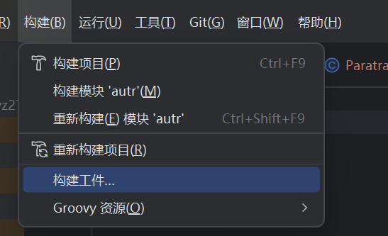
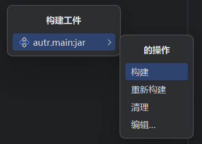

# QiuMvz2Translater
[English README](README.en.md)

本工具是秋冥为MVZ2 GMS2版本定制的外置文本文件格式转换和翻译工具。

建议下载翻译成果后用本工具执行转换操作并放在MVZ2 GMS2版本游戏目录的texts文件夹中。

**原本的项目还支持自动翻译和翻译缓存上传，由于包含个人的Token，所以不能公开，已经将相应代码剔除。**

## 如何使用此程序 
从Release下载jar文件，运行`java -jar .\autr.main.jar -l <文件路径>`

预期的文件路径可以是文件或者是目录。

**如果是目录：**

则处理目录下的所有.txt或.json文件（不包含子目录）

**如果是文件：**

文件扩展名可以为json或txt。输入为json则输出为txt，输入为txt则输出为json。

json是适用于[paratranz](https://paratranz.cn/projects/16795)翻译平台的文件。

格式如下：

```json5
[
  {
    "key":"ADVICE_TUTORIAL_01",
    "original":"左键点击器械卡牌选中器械！\r\n",
    "translation":"Left click on the instrument deck to select the instrument!\r\n"
  },
  //...
]
```

txt是MVZ2外置txt文本文件。

格式如下：

```text
[ADVICE_TUTORIAL_01]
左键点击器械卡牌选中器械！

[ADVICE_TUTORIAL_02]
点击草坪放置器械！

[ADVICE_TUTORIAL_03]
干得漂亮！
```


## 如何编译此项目
用Idea打开项目，依次点击“构建工件”，“autr.main:jar0”，“构建”。





然后会生成`out/artifacts/autr_main_jar/autr.main.jar`文件。

## 许可证 / License
MPL2.0